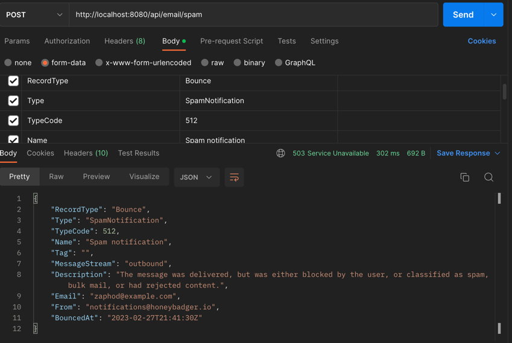
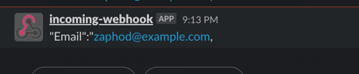

Setup
=======================================================

Clone repository - `git clone git@github.com:friscot1000/slack-integration.git`

install composer - `brew install composer`

cd into `slack-integration` and run `composer install`

Start the server by running - `php artisan serve --port=8080`

Endpoint
=======================================================

Using Postman call `POST http://localhost:8080/api/email/spam`

Pass the following payload 
````
   RecordType:Bounce
   Type:SpamNotification
   TypeCode:512
   Name:Spam notification
   Tag:
   MessageStream:outbound
   Email:zaphod@example.com
   Description:The message was delivered, but was either blocked by the user, or classified as spam, bulk mail, or had rejected content.
   From:notifications@honeybadger.io
   BouncedAt:2023-02-27T21:41:30Z
```
````
if Type is ```SpamNotification``` response will be 503 and user email will be sent to slack.  

Endpoint Response:


Slack:


